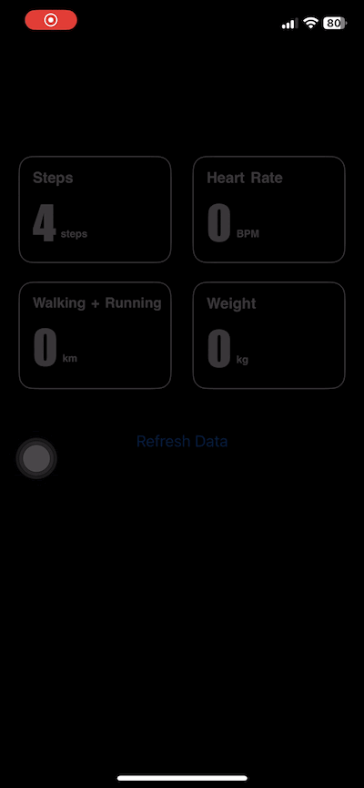

<h1 class="code-line" data-line-start=0 data-line-end=1 >HealthKit Swift Demo</h1>

This demo app showcases how to integrate Apple’s HealthKit framework in an iOS application. It allows reading health data, such as step count, heart rate, walking/running distance, and body mass.

<h2 class="code-line" data-line-start=4 data-line-end=5 >Features</h2>
<ul>
<li class="has-line-data" data-line-start="6" data-line-end="7">Request permissions to access HealthKit data</li>
<li class="has-line-data" data-line-start="7" data-line-end="8">Read health data from HealthKit</li>
<li class="has-line-data" data-line-start="8" data-line-end="10">Display retrieved health metrics in the app</li>
</ul>
<h2 class="code-line" data-line-start=10 data-line-end=11 >Health Data Types Used</h2>

This demo reads the following HealthKit quantity types:

<ul>
<li class="has-line-data" data-line-start="13" data-line-end="14">Step Count (HKQuantityTypeIdentifier.stepCount)</li>
<li class="has-line-data" data-line-start="14" data-line-end="15">Heart Rate (HKQuantityTypeIdentifier.heartRate)</li>
<li class="has-line-data" data-line-start="15" data-line-end="16">Walking/Running Distance (HKQuantityTypeIdentifier.distanceWalkingRunning)</li>
<li class="has-line-data" data-line-start="16" data-line-end="18">Body Mass (HKQuantityTypeIdentifier.bodyMass)</li>
</ul>
<h2 class="code-line" data-line-start=18 data-line-end=19 >Requirements</h2>
<ul>
<li class="has-line-data" data-line-start="20" data-line-end="21">Xcode 13 or later</li>
<li class="has-line-data" data-line-start="21" data-line-end="22">iOS 13 or later</li>
<li class="has-line-data" data-line-start="22" data-line-end="23">A physical device with HealthKit support (some features may not work on the simulator)</li>
<li class="has-line-data" data-line-start="23" data-line-end="25">HealthKit enabled in the app’s capabilities</li>
</ul>
<h2 class="code-line" data-line-start=25 data-line-end=26 >Setup</h2>
<ol>
<li class="has-line-data" data-line-start="27" data-line-end="28">Clone this repository:</li>
</ol>
<pre><code class="has-line-data" data-line-start="29" data-line-end="31" class="language-sh">     git clone https://github.com/skety777/healthkit-swift.git
</code></pre>
<ol start="2">
<li class="has-line-data" data-line-start="31" data-line-end="32">Open the project in Xcode.</li>
<li class="has-line-data" data-line-start="32" data-line-end="33">Enable HealthKit in Signing &amp; Capabilities.</li>
<li class="has-line-data" data-line-start="33" data-line-end="35">Run the app on a compatible iOS device.</li>
</ol>
<h2 class="code-line" data-line-start=35 data-line-end=36 >Permissions</h2>

The app requests permission to read the above-mentioned health data. Users must grant access in the Health app under Settings &gt; Privacy &gt; Health.

<h2 class="code-line" data-line-start=39 data-line-end=40 >Code Snippet</h2>

The app requests permission to read health data using the following Swift code:

<pre><code class="has-line-data" data-line-start="43" data-line-end="54" class="language-sh">var allDataTypes: Set&lt;HKQuantityType&gt; {
    let types: [HKQuantityType] = [
        HKQuantityType.quantityType(forIdentifier: .stepCount),
        HKQuantityType.quantityType(forIdentifier: .heartRate),
        HKQuantityType.quantityType(forIdentifier: .distanceWalkingRunning),
        HKQuantityType.quantityType(forIdentifier: .bodyMass)
    ].compactMap { $0 } // Remove any nil values
    
    return Set(types)
}
</code></pre>
<h2 class="code-line" data-line-start=55 data-line-end=56 >License</h2>

This project is open-source and available under the MIT License.

<h2 class="code-line" data-line-start=59 data-line-end=60 >Author</h2>

Developed by Me.

